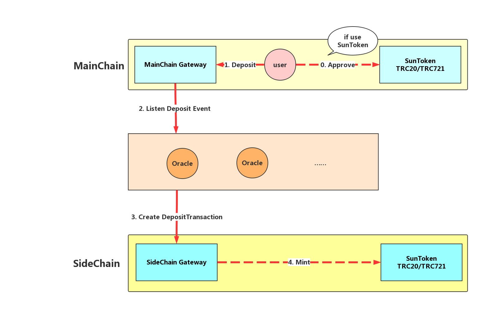
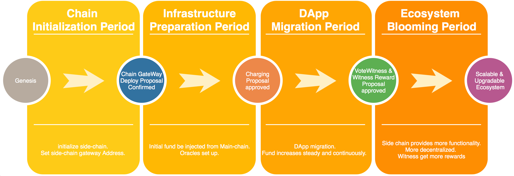

# Developer Documents

## I. Overview

### 1. Sun-network Project

Sun Network Plan is an expansion plan for TRON main network ecosystem, including smart contract application oriented side-chain(DAppChain), cross-chain communication and other expansion projects. DAppChain is a side-chain project of TRON, which focuses on providing unlimited capacity expansion for the whole network. DAppChain is also designed to provide a low cost system for user and help DApp to operate safely and efficiently on TRON.

### 2. DAppChain Features

DAppChain is the first product of Sun-network Project. The chain is compatible with TRON main-chain, and fully support smart contract with low consumption, high security and high efficiency.

#### 2.1 Compatible with TRON main-chain

The side-chain uses the same DPoS consensus mechanism as the main-net and support almost all functions on it. TRON main-net users can easily switch to the side-chain, developers can also quickly transplant or develop new DApps on the side-chain.

#### 2.2 Highly customizable side-chain

DAppChain is committed to providing a highly flexible, well-configured, highly customizable multi-side-chain system for all eco-participants. Highly customizable is also one key feature different from the main-chain.

#### 2.3 Increase higher TPS for the ecosystem

TRON main network supports multiple side-chain connections, which means TRON ecosystem can increases its TPS infinitely. According to the TPS peak 2000 on the main network, the whole TRON ecosystem TPS can reach 2000 \* SideChainNum with the increasing of side-chains numbers.

#### 2.4 low consumption

Under the same circumstances, the resource cost on the side-chain is only half or even much more less than the main network. This can help DApp developers reduce development and operation costs. Low consumption is also aiming at attracting small developer teams to participate in the ecosystem construction.

#### 2.5 Safe assets migration

The first phase of DAppChain use DPoS mechanism for consensus. Gateway contract and Oracle relay nodes ensure the transaction efficiency and asset security on-chain and cross-chain.

#### 2.6 Complete API and developer toolset

We provide a TRON network compatible toolset, which have all the functionality of a developer need to build his own DApp on DAppChain. And we also provide new cross-chain APIs to help reduce developer learning costs when deal with cross chain operations. The SDK have both Java and JS version for developers to choose.

## II. DAppChain

### 1. DAppChain architecture and components functions

This section will explain the architecture of DAppChain.


As above picture shows, DAppChain contains 4 main parts:

- MainChain Gateway contract, provide asset mapping, asset deposit to side-chain and asset withdraw from side-chain functionalities on main-chain.
- Multiple oracle relay nodes, provide cross-chain transaction validation, mapping/deposit/withdraw transaction broadcast functions.
- SideChain Gateway contract, provide asset management on side-chain.
- SideChain, function based on main-chain, but customized a few mechanism to fit side-chain model

### 2. Side-chain

#### 2.1 Overview

Side-chain is the key part of DAppChain project. The chain produces a block every 3 seconds using DPoS mechanism. The chain itself guarantee side-chain transaction consensus and confirm cross chain transaction along with multiple oracle relay nodes.

#### 2.2 Consensus

Same as main-chain, side-chain uses the DPoS consensus for block producer election. Multiple witnesses govern side-chain ecosystem together. Witnesses play roles as side-chain transaction validators. As long as 2/3 of the witnesses confirm transactions in a block, the transactions are accepted by the system.

#### 2.3 Available Proposals

#### 2.4 Side-chain special features:

Fund: current reward pool for witness. A reward pool for community government. Part of the profit of side-chain will be inject into the pool. This will achieve a balance between witness reward and chain owner reward.

FundInject: A side-chain system contract interface for reward pool fund injection. It opens for anyone who want to donate TRX to side-chain ecosystem. However, only founder address can get chain reward, the reset will be regard as witness reward.

Mine function: a new precompile solidity function to mine TRX which deposited from main-chain. It is very similar to a coin base function.

MineToken function: a new precompile solidity function to mine TRC10 token which deposited from man chain. Same as mine function above.

### 3. Contract

#### 3.1 Contract Type

Contract is consist of 3 parts:
MainChain gateway contract,
SideChain gateway contract,
Standard TRC20/TRC721 contract

TRC20/TRC721 will be automatically generated on side chain in gateway contract. In this case, new asset contracts will not contain abi. Thus, user has to use triggerconstantcontract method to call a constant function to avoid broadcasting transactions and charging fees.

#### 3.2 MainChain gateway contract and SideChain gateway contract.

##### 3.2.1 TRC20/TRC721 contract mapping:

```Solidity
//use mappingTRC20 as an example
//Main-chain gateway contract method
function mappingTRC20(bytes txId) public onlyNotStop onlyNotPause goDelegateCall payable returns (uint256) {
require(msg.value >= mappingFee, "trc20MappingFee not enough");
if (msg.value > 0) {
bonus += msg.value;
}
address trc20Address = calcContractAddress(txId, msg.sender);
require(trc20Address != sunTokenAddress, "mainChainAddress == sunTokenAddress");
require(mainToSideContractMap[trc20Address] != 1, "trc20Address mapped");
uint256 size;
assembly {size := extcodesize(trc20Address)}
require(size > 0);
userMappingList.push(MappingMsg(trc20Address, DataModel.TokenKind.TRC20, DataModel.Status.SUCCESS));
mainToSideContractMap[trc20Address] = 1;
emit TRC20Mapping(trc20Address, userMappingList.length - 1);
return userMappingList.length - 1;
}
//Side-chain gateway method
function deployDAppTRC20AndMapping(address mainChainAddress, string name, string symbol, uint8 decimals) internal returns (address r) {
address sideChainAddress = new DAppTRC20(address(this), name, symbol, decimals);
mainToSideContractMap[mainChainAddress] = sideChainAddress;
sideToMainContractMap[sideChainAddress] = mainChainAddress;
emit DeployDAppTRC20AndMapping(mainChainAddress, sideChainAddress);
r = sideChainAddress;
}

```

TRC20/TRC721 contract owner has to put their contract deployment transaction id to MainChain gateway contract on main-chain. Gateway contract would verify the existence of the transaction. Multiple oracle will verify and confirm the mapping operations and generate a corresponding TRC20/TRC721 contract on side-chain.

##### 3.2.2 Asset deposit operation

```Solidity
//use depositTRX as an example
//MainChain gateway contract method
function depositTRX() payable public onlyNotStop onlyNotPause goDelegateCall returns (uint256) {
  require(msg.value > 0, "value must be > 0");
  require(msg.value >= depositMinTrx, "value must be >= depositMinTrx");
  require(msg.value <= uint64Max, "msg.value must <= uint64Max");
  userDepositList.push(DepositMsg(msg.sender, uint64(msg.value), 0, address(0), 0, 0, 0));
  emit TRXReceived(msg.sender, uint64(msg.value), userDepositList.length - 1);
  return userDepositList.length - 1;
}
//SideChain gateway contract method
function depositTRX(address to, uint256 value) internal {
  mintTRXContract.call(value);
  to.transfer(value);
  emit DepositTRX(to, value);
}
```

When a user deposit TRX/TRC10/TRC20/TRC721 assets, the assets will be locked in main-chain gateway. On side-chain , multiple oracle will confirm deposit operation, and side-chain gateway will mint new asset to user side-chain account.

##### 3.2.3 Asset withdraw operation

```Solidity
//use withdrawTRX as an example
//side-chain gateway contract method
function withdrawTRX() payable public onlyNotPause onlyNotStop goDelegateCall returns (uint256 r) {
        require(msg.value >= withdrawMinTrx + withdrawFee, "value must be >= withdrawMinTrx+withdrawFee");
        if (msg.value > 0) {
            bonus += withdrawFee;
        }
        uint256 withdrawValue = msg.value - withdrawFee;
        require(withdrawValue > 0, "withdrawValue must be > 0");
        userWithdrawList.push(WithdrawMsg(msg.sender, address(0), 0, withdrawValue, DataModel.TokenKind.TRX, DataModel.Status.SUCCESS));
        // burn
        address(0).transfer(withdrawValue);
        emit WithdrawTRX(msg.sender, withdrawValue, userWithdrawList.length - 1);
        r = userWithdrawList.length - 1;
    }
//MainChain gateway contract method
function withdrawTRX(address to, uint256 value, uint256 nonce, bytes[] oracleSigns)
    public onlyNotStop onlyOracle goDelegateCall {
        require(oracleSigns.length <= numOracles, "withdraw TRX signs num > oracles num");
        bytes32 dataHash = keccak256(abi.encodePacked(to, value, nonce));
        bool needWithdraw = checkOracles(dataHash, nonce, oracleSigns);
        if (needWithdraw) {
            to.transfer(value);
            // ensure it's not reentrant
            emit TRXWithdraw(to, value, nonce);
        }
    }
```

Different from deposit and mapping, withdraw operation is triggered on side-chain. Similar to deposit operation, user can use gateway contract to trigger withdraw operation for their TRX/TRC10/TRC20/TRC721 assets. Asset on side-chain will be destroyed when it leaving side-chain.

#### 3.3 Side-chain standard

TRC20/TRC721 only Implement TRON basic interfaces. And add two mint functions in the contract. Also add two standard withdraw function for TRC20/TRC721 WI.

```Solidity
//Functions in standard TRC20 contract
function mint(address to, uint256 value) external onlyGateway {
        require(to != address(0));
        _totalSupply = _totalSupply.add(value);
​        _balances[to] = _balances[to].add(value);
​        emit Transfer(address(0), to, value);
​    }
    function withdrawal(uint256 value) payable external returns (uint256 r) {
​        transfer(gateway, value);
​        r = ITRC20Receiver(gateway).onTRC20Received.value(msg.value)(msg.sender, value);
​    }
//Functions in standard TRC721 contract
function mint(address to, uint256 tokenId) external onlyGateway {
​        require(to != address(0));
​        require(!_exists(tokenId));
        _tokenOwner[tokenId] = to;
​        _ownedTokensCount[to] = _ownedTokensCount[to].add(1);
        emit Transfer(address(0), to, tokenId);
​    }
    function withdrawal(uint256 tokenId) payable external returns (uint256 r) {
​        transfer(gateway, tokenId);
​        r = ITRC721Receiver(gateway).onTRC721Received.value(msg.value)(msg.sender, tokenId);
​    }
```

### 4. Cross-chain details

#### 4.1 Overview

DAppChain contains 3 main components for cross-chain interaction: MainChain gateway contract, Oracle service, and Side-chain gateway contract.

Oracle listens to the messages from the main-chain gateway contract and the side-chain gateway contract, and realizes the interactive communication between the main-chains and side-chains. When more than 2/3 of the oracle nodes confirmed an cross-chain transaction, the transaction can be considered to be valid.

Cross-chain interaction can be classified as 3 main type: TRC20/TRC721 contract mapping, asset deposit, and asset withdraw.


#### 4.2 TRC20/TRC721 contract mapping

Asset owner need to trigger TRC20/TRC721 mapping function to approve access for the asset to migrate to side-chain. The asset can be mapping to side-chain automatically, and no one need to deploy by themselves.


Steps:

1. Deployer should own(deployed) an TRC20/TRC721 contract on main-chain.
1. Asset Deployer should trigger mapping function in gateway contract for owned TRC20/TRC721 contract. Gateway contract will verified the ownership. If verified, an deploy event will be event.
1. Oracle catches the deploy event.
1. Oracle trigger side-chain gateway contract to create TRON standard side-chain TRC20/TRC721 contract, and do a cross-chain mapping.

#### 4.3 Deposit

User uses deposit function in gateway contract for asset migration to side-chain purpose.



Steps:

1. When migrate TRC20/TRC721 token, user need to trigger an approve function in TRC20/TRC721 contract on main-chain.
1. User triggers deposit function in MainChain gateway contract.
1. Oracle catches deposit event.
1. Oracle call function in SideChain gateway for asset migration.
1. For TRC20/TRC7212 token, side-chain will mint specific amount of token in the mapped contract, while TRX/TRC10 token will be added directly on user account.

#### 4.4 Withdraw

User uses withdraw function in gateway contract for asset migration to main-chain purpose.


Steps:

1. When migrate TRC20/TRC721 token, user need to trigger an approve function in TRC20/TRC721 contract on side-chain. Gateway contract would call TRC20/TRC721 contract directly due to our customization.
1. Oracle catches the withdraw event.
1. User calls the withdraw function on main-chain.
1. MainChain gateway contract calls TRC20/TRC721 contract for withdraw operation, while TRX/TRC10 would be able to send directly to user account.

### 5. Incentive

1. Block production reward will keep the same in the same maintenance interval.
2. Reward changes in different maintenance interval:
   payPerBlock = fund / ((86400 / 3 ) \* dayToSustainByFund)
   payPerBlock: block production reward for each block
   Fund: current reward pool TRX amount
   dayToSustainByFund: Fund distribution period

3. Witness reward would be divided into two parts according to percentToPayWitness value. Part is for witness, the rest will be send to founder:
   payForWitnessPerBlock = payPerBlock \* percentToPayWitness / 100
   payForFounderPerBlock = payPerBlock - payForWitnessPerBlock
   payForWitnessPerBlock: reward for witness along single block produce interval
   payForFounderPerBlock: reward for founder along single block produce interval

## III. how to connect to DAppChain

### 1. DAppChain node list

(coming soon…)

### 2. DAppChain testnet node list

#### Full Nodes

Http Interface

- 47.252.85.90:8090
- 47.252.80.185:8090
- 47.252.84.141:8090

RPC Interface

- 47.252.85.90:50051
- 47.252.80.185:50051
- 47.252.84.141:50051

#### Solidity Nodes

Http Interface

- 47.252.85.90:8091
- 47.252.80.185:8091
- 47.252.84.141:8091

RPC Interface

- 47.252.85.90:50060
- 47.252.80.185:50060
- 47.252.84.141:50060

### 2. DAppChain testnet gateway address
- main chain gateway: TEaRKX1nazX7EiCu3XwaHjLZeCrHRLXoRa
- side chain gateway: TDdo671JXH5S74iVvXEDyUXSgADYtg5ns7

### 3. Apply for test coins

<token/>

### 4. Connection tools

Via sun-scan (cooming soon)
Via sun-cli (see developer document)
Via SDK (see developer document)

## IV. SDK quick starts

If you want to learn how to develop TRON smart contracts and DApps on the side-chain, please refer to the JAVA SDK and JS SDK documentation below.
If you are new to TRON Smart Contract development, please move to our github demo pages and refer to our code for next step.

## V. JAVA SDK

DAppChain provide a java version of SDK for developer to build their DApp. It contains a complete tool set for on-chain, cross-chain functions.

### SDK initiation

An SDK object need to be initiated when start to use the SDK. IServerConfig interface need to be implemented for parameter configuration. And if your DApp need multisign functionality, you need to implement IMultiTransactionSign interface as well.

```
Sdk = new SunNetwork();
SunNetworkResponse<Integer> ret = sdk.init(new ServerConfigImpl(), new MultiSignTransactionImpl());
```

There are three services in this SDK.

```java
//Main-chain interface
sdk.getMainChainService();
//Side-chain interface
sdk.getSideChainService();
//Cross-chain interaction interface
sdk.getCrossChainService();
```

### Cross-chain interface

#### Mapping

1. TRC20 mapping

```java
// Called by the deployer of the TRC20 contract on the main-chain to complete the mapping of the TRC20 contract from the main-chain to the side-chain, the standard 20 contract deployed in the side-chain corresponds to the main-chain TRC20 contract.
SunNetworkResponse<TransactionResponse> resp = sdk.getCrossChainService().mappingTrc20(trxHash, feeLimit);
//Return value: Use sdk.getSideChainService().getTransactionInfoById(txid) to query resp.getData().getTrxId() to get the nonce value of this mapping operation.
```

| Parameter | Description                                                                   |
| --------- | ----------------------------------------------------------------------------- |
| trxHash   | deployContract transaction for deploying TRC20 contracts on the main-chain id |
| feeLimit  | Maximum energy consumption when triggering a contract                         |

2. TRC721 mapping

```java
// Called by the deployer of the TRC721 contract on the main-chain to complete the mapping of the TRC721 contract from the main-chain to the side-chain, the standard TRC721 contract will be deployed in the side-chain corresponding to the main-chain TRC721 contract.
SunNetworkResponse<TransactionResponse> resp = sdk.getCrossChainService().mappingTrc721(trxHash, feeLimit);
//Return value: Use sdk.getSideChainService().getTransactionInfoById(txid) to query resp.getData().getTrxId() to get the nonce value of this mapping operation.
```

| Parameter | Description                                                         |
| --------- | ------------------------------------------------------------------- |
| trxHash   | deployContract transaction id for TRC721 contract on the main-chain |
| feeLimit  | Maximum energy consumption when triggering a contract               |

#### Deposit

1. TRX deposit

```java
//Pledge a certain number of TRX from the main-chain to the side-chain
SunNetworkResponse<TransactionResponse> resp = sdk.getCrossChainService().depositTrx(num, feeLimit);
//Return value: Use sdk.getSideChainService().getTransactionInfoById(txid) to query resp.getData().getTrxId() to get the nonce value of this deposit operation.
```

| Parameter | Description                                           |
| --------- | ----------------------------------------------------- |
| num       | TRX Quantity (Unit SUN)                               |
| feeLimit  | Maximum energy consumption when triggering a contract |

2. TRC10 token deposit

```java
//Pledge a certain number of designated TRC10 from the main-chain to the side-chain
SunNetworkResponse<TransactionResponse> resp = sdk.getCrossChainService().depositTrc10(tokenId, tokenValue, feeLimit);
//Return value: Use sdk.getSideChainService().getTransactionInfoById(txid) to query resp.getData().getTrxId() to get the nonce value of this deposit operation.
```

| Parameter  | Description                                           |
| ---------- | ----------------------------------------------------- |
| tokenId    | Token ID of TRC10                                     |
| tokenValue | TRC10 Quantity of Assets                              |
| feeLimit   | Maximum energy consumption when triggering a contract |

3. TRC20 token deposit

```java
//Pledge a certain number of designated TRC20 from the main-chain to the side-chain
SunNetworkResponse<TransactionResponse> resp = sdk.getCrossChainService().depositTrc20(contractAddrStr, num, feeLimit);
//Return value: Use sdk.getSideChainService().getTransactionInfoById(txid) to query resp.getData().getTrxId() to get the nonce value of this deposit operation.
```

| Parameter       | Description                                           |
| --------------- | ----------------------------------------------------- |
| contractAddrStr | Main-chain TRC20 Contract Address                     |
| num             | TRC20 Asset Quantity                                  |
| feeLimit        | Maximum energy consumption when triggering a contract |

4. TRC721 token deposit

```java
//Pledge a certain number of designated TRC721 from the main-chain to the side-chain
SunNetworkResponse<TransactionResponse> resp = sdk.getCrossChainService().depositTrc721(contractAddrStr, num, feeLimit);
//Return value: Use sdk.getSideChainService().getTransactionInfoById(txid) to query resp.getData().getTrxId() to get the nonce value of this deposit operation.
```

| Parameter       | Description                                           |
| --------------- | ----------------------------------------------------- |
| ContractAddrStr | Main-chain TRC721 Contract Address                    |
| num             | TRC721 Asset Quantity                                 |
| feeLimit        | Maximum energy consumption when triggering a contract |

#### Withdraw

1. TRX withdraw

```java
//Exit a certain number of TRX from the side-chain to the main-chain
SunNetworkResponse<TransactionResponse> resp = sdk.getCrossChainService().withdrawTrx(num, feeLimit);
//Return value: Use sdk.getSideChainService().getTransactionInfoById(txid) to query resp.getData().getTrxId() to get the nonce value of this withdraw operation.
```

| Parameter | Description                                           |
| --------- | ----------------------------------------------------- |
| num       | TRX Quantity (Unit SUN)                               |
| feeLimit  | Maximum energy consumption when triggering a contract |

2. TRC10 token withdraw

```java
//Pledge a certain number of designated TRC10 from the side-chain to the main-chain
SunNetworkResponse<TransactionResponse> resp = sdk.getCrossChainService().withdrawTrc10(tokenId, tokenValue, feeLimit);
//Return value: Use sdk.getSideChainService().getTransactionInfoById(txid) to query resp.getData().getTrxId() to get the nonce value of this withdraw operation.
```

| Parameter  | Description                                           |
| ---------- | ----------------------------------------------------- |
| tokenId    | Token ID of TRC10                                     |
| tokenValue | TRC10 Quantity of Assets                              |
| feeLimit   | Maximum energy consumption when triggering a contract |

3. TRC20 token withdraw

```java
//Pledge a certain number of designated TRC20 from the side-chain to the main-chain
SunNetworkResponse<TransactionResponse> resp = sdk.getCrossChainService().withdrawTrc20(contractAddrStr, num, feeLimit);
//Return value: Use sdk.getSideChainService().getTransactionInfoById(txid) to query resp.getData().getTrxId() to get the nonce value of this withdraw operation.
```

| Parameter       | Description                                           |
| --------------- | ----------------------------------------------------- |
| contractAddrStr | Side-chain TRC20 Contract Address                     |
| num             | TRC20 Asset Quantity                                  |
| feeLimit        | Maximum energy consumption when triggering a contract |

4. TRC721 token withdraw

```java
//Pledge a certain number of designated TRC721 from the side-chain to the main-chain
SunNetworkResponse<TransactionResponse> resp = sdk.getCrossChainService().withdrawTrc721(contractAddrStr, num, feeLimit);
//Return value: Use sdk.getSideChainService().getTransactionInfoById(txid) to query resp.getData().getTrxId() to get the nonce value of this withdraw operation.
```

| Parameter       | Description                                           |
| --------------- | ----------------------------------------------------- |
| contractAddrStr | Side-chain TRC721 Contract Address                    |
| num             | TRC721 Asset Quantity                                 |
| feeLimit        | Maximum energy consumption when triggering a contract |

#### Retry

1. Retry deposit

```java
//Retry the unsuccessful main-chain deposit operation
SunNetworkResponse<TransactionResponse> resp = sdk.getCrossChainService().retryDeposit(nonce, feeLimit);
```

| Parameter | Description                                           |
| --------- | ----------------------------------------------------- |
| nonce     | deposit operation nonce value                         |
| feeLimit  | Maximum energy consumption when triggering a contract |

2. Retry withdraw

```java
//Retry the unsuccessful side-chain withdraw operation
SunNetworkResponse<TransactionResponse> resp = sdk.getCrossChainService().retryWithdraw(nonce, feeLimit);
```

| Parameter | Description                                           |
| --------- | ----------------------------------------------------- |
| nonce     | withdraw operation nonce value                        |
| feeLimit  | Maximum energy consumption when triggering a contract |

3. Retry mapping

```java
//Retry the unsuccessful main-chain mapping operation
SunNetworkResponse<TransactionResponse> resp = sdk.getCrossChainService().retryMapping(nonce, feeLimit);
```

| Parameter | Description                                           |
| --------- | ----------------------------------------------------- |
| nonce     | mapping operation's nonce value                       |
| feeLimit  | Maximum energy consumption when triggering a contract |

### Side-chain interfaces

1. Fund injection

```java
//Investors from the side-chain will inject funds into the side-chain fund pool
SunNetworkResponse<TransactionResponse> resp = sdk.getMainChainService().fundInject(amount);
```

| Parameter | Description                                                         |
| --------- | ------------------------------------------------------------------- |
| amount    | Quantity of funds injected into the side-chain fund pool (unit SUN) |

2. Proposal on side-chain

```java
//Query side-chain all proposal list information
SunNetworkResponse<TransactionResponse> resp = sdk.getSideChainService().listProposals();
//Parameter: None

```

```java
//Query side-chain proposal information according to the proposal number
SunNetworkResponse<TransactionResponse> resp = getSideChainService().getProposal(id);
```

| Parameter | Description     |
| --------- | --------------- |
| id        | Proposal number |

3. Get chain parameters on Side-chain

```java
//Query all the parameters of the side-chain blockchain committee can be set
SunNetworkResponse<TransactionResponse> resp = getSideChainService().getSideChainParameters();
```

### Main-chain interfaces

1. Proposal on Main-chain

```java
//Query all the proposal list information of the main-chain
SunNetworkResponse<TransactionResponse> resp = sdk.getMainChainService().listProposals();
```

```java
//Query side-chain proposal information according to the proposal number
SunNetworkResponse<TransactionResponse> resp = getMainChainService().getProposal(id);
```

| Parameter | Description     |
| --------- | --------------- |
| id        | Proposal number |

2. Get chain parameters on Main-chain

```java
//Query all the parameters of the main-chain blockchain committee can be set
SunNetworkResponse<TransactionResponse> resp = getMainChainService().getChainParameters();
```

### Common interfaces of main-chain and sidechain

1. Get current user address

```java
//Get the address of the current user of sdk
SunNetworkResponse<byte[]> resp = getChainService().getAddress()
```

2. Get current user account balance

```java
//Get the current user's TRX sdk
SunNetworkResponse<long> resp = getChainService().getBalance()
```

3. Get current user status

```java
//Get account information based on the address
SunNetworkResponse<Account> result = getChainService().getAccount(address);
```

4. TRX transferring

```java
//Transfer the TRX operation
SunNetworkResponse<TransactionResponse> = getChainService().sendCoin(toAddress, amount);
```

5. TRC10 token transferring

```java
//Transfer the TRC10 operation
SunNetworkResponse<TransactionResponse> = getChainService().transferAsset(toAddress, assertName, amount);
```

## VI. SunWeb

SunWeb inherits from [TronWeb](https://developers.tron.network/docs/tron-web-intro) and services for Sun-network. We encapsulated two objects (main-chain and sidechain) based on TronWeb. The methods and attributes in main-chain or side-chain are exactly the same as the tronweb instance. For example, users can use sunweb.mainchain.trx.getBalance() to get balance from the mainchain. Futhermore, we add some new methods which are as follows in SunWeb class so that users can use them to contact between the main-chain and the side-chain. And users can visit the source code from [github](https://github.com/tronprotocol/sun-network/tree/develop/js-sdk).

### SunWeb class

#### SubWeb instantiation

To use the SunWeb library in your App, you need to instantiate Sunweb.

You can define two objects mainOptions and sideOptions which respectively contains the following key:

- fullNode
- solidityNode
- eventServer

You can also set a:

- fullHost

which works as a jolly. If you do so, though, the more precise specification has priority.

And besides, you may also need to set gateway address:

- mainGatewayAddress
- sideGatewayAddress
- sideChainId
- privateKey (optional)

Supposing you are using a server which provides everything, like TronGrid, you can instantiate SunWeb as:

```javascript
cconst sunWeb = new SunWeb({
  fullHost: 'https://mainapi.trongrid.io'
  }, {
  fullHost: 'https://sideapi.trongrid.io'
  },
  mainGatewayAddress,
  sideGatewayAddress,
  sideChainId,
  privateKey: '...');
```

If you are using different servers for anything, you can instantiate like:

```javascript
const sunWeb = new SunWeb({
  fullNode: 'http://fullnode.tron.network',
  solidityNode: 'http://solidity.tron.network',
  eventServer: 'http://mainapi.trongrid.io'
  }, {
  fullNode: 'http://fullnode.sun.network',
  solidityNode: 'http://solidity.sun.network',
  eventServer: 'http://sideapi.trongrid.io'
  },
  mainGatewayAddress,
  sideGatewayAddress,
  sideChainId,
  privateKey: '...');
```

For example, you can create a sunWeb instance connected to out sun network test-net like:

```javascript
const sunWeb = new SunWeb(
  {
    fullNode: 'http://47.252.84.158:8090',
    solidityNode: 'http://47.252.84.158:8090',
    eventServer: 'http://47.252.84.141:8080'
  },
  {
    fullNode: 'http://47.252.85.90:8090',
    solidityNode: 'http://47.252.85.90:8091',
    eventServer: 'http://47.252.85.90:8090'
  },
  'TGHxhFu4jV4XqMGmk3tEQdSeihWVHE9kBP',
  'TBHr5KpbA7oACUysTKxHiAD7c6X6nkZii1',
  '41455CB714D762DC46D490EAB37BBA67B0BA910A59',
  privateKey
);
```

### Asset deposit

deposit asset from main-chain to sidechain

#### depositTrx

##### deposit trx from main-chain to side-chain

```javascript
// Format
sunWeb.depostiTrx(callValue, feeLimit, options);

// example
sunWeb.depositTrx(100000000, 1000000);
```

##### Arguments

| Parameter | Description                             | Type                   | Options  |
| --------- | --------------------------------------- | ---------------------- | -------- |
| callValue | Amount of TRX (Units in SUN) to deposit | Integer (Units in SUN) | Required |
| feeLimit  | Cost limit                              | Integer, long          | Required |
| options   | The permissions Id                      | Object                 | Optional |

#### depositTrc10

##### deposit TRC10 token from main-chain to side-chain

```javascript
// format
sunWeb.depositTrc10(tokenId, tokenValue, feeLimit, options);

// example
sunWeb.depositTrc10(100059, 10000000, 100000);
```

##### Arguments

| Parameter  | Description                                     | Type                   | Options  |
| ---------- | ----------------------------------------------- | ---------------------- | -------- |
| tokenId    | Token Id of trc10                               | Integer                | Required |
| tokenValue | Amount of trc10 token (Units in SUN) to deposit | Integer (Units in SUN) | Required |
| feeLimit   | Cost limit                                      | Integer, long          | Required |
| options    | The permissions Id                              | Object                 | Optional |

#### depositTrc20

##### deposit TRC20 token from main-chain to side-chain

Note: You have to mapping TRC20 contract to side-chain with the mappingTrc20 function provided by SunWeb. Then you also have to use the approveTrc20 function. Only done with the two steps before, you can depositTrc20 from main-chain to side-chain.

```javascript
// format
sunWeb.depositTrc10(num, feeLimit, contractAddress, options);

// example
sunWeb.depositTrc10(1000000, 1000000, 'TD9Jrm546pGkzRu7K5nitMxk8nn75wXNkQ');
```

##### Arguments

| Parameter       | Description                               | Type          | Options  |
| --------------- | ----------------------------------------- | ------------- | -------- |
| Num             | Amount of TRC20 (Units in SUN) to deposit | Integer       | Required |
| feeLimit        | Cost limit                                | Integer, long | Required |
| contractAddress | Main-chain TRC20 Contract Address         | String        | Required |
| options         | The permissions Id                        | Object        | Optional |

#### depositTrc721

##### deposit TRC721 token from main-chain to side-chain

Note: You have to use mappingTrc721 and approveTrc721 before depositTrc721 like depositTrc20.

```javascript
// format
sunWeb.depositTrc721(id, feeLimit, contractAddress, options);

// example
sunWeb.depositTrc10(1000000, 1000000, 'TCLRqK6aP2xsCZWhE2smkYzdRHf9uvyz5P');
```

##### Arguments

| Parameter       | Description                        | Type          | Options  |
| --------------- | ---------------------------------- | ------------- | -------- |
| id              | Id of TRC721 to deposit            | Integer       | Required |
| feeLimit        | cost limit                         | Integer, long | Required |
| contractAddress | Main-chain TRC721 Contract Address | String        | Required |
| options         | The permissions Id                 | Object        | Optional |

### Asset approve

Before depositTrc20 and depositTrc721, you should call the approve function.

#### approveTrc20

##### Approve TRC20 token

```javascript
// format
sunWeb.approveTrc20(num, feeLimit, contractAddress, options);

// example
sunWeb.approveTrc20(10000, 10000000, 'TGKuXDnvdHv9RNE6BPXUtNLK2FrVMBDAuA');
```

##### Arguments

| Parameter       | Description                       | Type          | Options  |
| --------------- | --------------------------------- | ------------- | -------- |
| Num             | Num of TRC20                      | Integer       | Required |
| contractAddress | Main-chain TRC20 Contract Address | String        | Required |
| feeLimit        | Cost limit                        | Integer, long | Required |
| options         | The permissions Id                | Object        | Optional |

#### approveTrc721

##### Approve TRC721 token

```javascript
// format
sunWeb.approveTrc721(id, feeLimit, contractAddress, options);

// example
sunWeb.approveTrc721(100, 10000000, 'TUxDmFbEceGgjWCb6rLVcrFgnsWwofPdPq');
```

##### Arguments

| Parameter       | Description                        | Type          | Options  |
| --------------- | ---------------------------------- | ------------- | -------- |
| Num             | Id of TRC721                       | Integer       | Required |
| contractAddress | Main-chain TRC721 Contract Address | String        | Required |
| feeLimit        | Cost limit                         | Integer, long | Required |
| options         | The permissions Id                 | Object        | Optional |

### Asset mapping

#### mappingTrc20

##### mapping TRC20 token to side-chain

```javascript
// format
mappingTrc20(trxHash, mappingFee, feeLimit, options);

// example
mappingTrc20('548442d9080605a60adf1d30cc126a2b9c6308cbe9ec224f8c67a6c2590fa299', 100000, 10000, options);
```

##### Arguments

| Parameter  | Description                                                                    | Type                  | Options  |
| ---------- | ------------------------------------------------------------------------------ | --------------------- | -------- |
| trxHash    | The hash value of the transaction for the main-chain deployment TRC20 contract | Hex string            | Required |
| mappingFee | Mapping Fee                                                                    | Integer(units in SUN) | Required |
| feeLimit   | cost limit                                                                     | Integer, long         | Required |
| options    | The permissions Id                                                             | Object                | Optional |

#### mappingTrc721

##### mapping TRC721 token to side-chain

```javascript
// format
mappingTrc721(trxHash, mappingFee, feeLimit, options);

// example
mappingTrc721('548442d9080605a60adf1d30cc126a2b9c6308cbe9ec224f8c67a6c2590fa299', 100000, 1000, options);
```

##### Arguments

| Parameter  | Description                                                                     | Type                  | Options  |
| ---------- | ------------------------------------------------------------------------------- | --------------------- | -------- |
| trxHash    | The hash value of the transaction for the main-chain deployment TRC721 contract | Hex string            | Required |
| mappingFee | Mapping Fee                                                                     | Integer(units in SUN) | Required |
| feeLimit   | cost limit                                                                      | Integer, long         | Required |
| options    | The permissions Id                                                              | Object                | Optional |

### Asset withdraw

#### withdrawTrx

##### Withdraw trx from side-chain to main-chain

```javascript
// Format
sunWeb.withdrawTrx(callValue, withdrawFee, feeLimit, options);

// example
sunWeb.withdrawTrx(100000000, 10000, 1000000);
```

##### Arguments

| Parameter   | Description                             | Type                   | Options  |
| ----------- | --------------------------------------- | ---------------------- | -------- |
| callValue   | Amount of TRX (Units in SUN) to deposit | Integer (Units in SUN) | Required |
| withdrawFee | Withdraw Fee                            | Integer(Units in SUN)  | Required |
| feeLimit    | Cost limit                              | Integer, long          | Required |
| options     | The permissions Id                      | Object                 | Optional |

#### withdrawTrc10

##### Withdraw TRC10 token from side-chain to main-chain

```javascript
// format
sunWeb.withdrawTrc10(tokenId, tokenValue, withdrawFee, feeLimit, options);

// example
sunWeb.withdrawTrc10(100059, 10000000, 10000, 100000);
```

##### Arguments

| Parameter   | Description                                     | Type                   | Options  |
| ----------- | ----------------------------------------------- | ---------------------- | -------- |
| tokenId     | Token Id of TRC10                               | Integer                | Required |
| tokenValue  | Amount of TRC10 token (Units in SUN) to deposit | Integer (Units in SUN) | Required |
| withdrawFee | Withdraw Fee                                    | Integer(Units in SUN)  | Required |
| feeLimit    | Cost limit                                      | Integer, long          | Required |
| options     | The permissions Id                              | Object                 | Optional |

#### withdrawTrc20

##### withdraw TRC20 token from side-chain to main-chain

```javascript
// format
sunWeb.withdrawTrc20(num, withdrawFee, feeLimit, contractAddress, options);

// example
sunWeb.withdrawTrc20(10000, 10000, 10000000, 'TWzXQmDoASGodMss7uPD6vUgLHnkQFX7ok');
```

##### Arguments

| Parameter       | Description                                     | Type                  | Options  |
| --------------- | ----------------------------------------------- | --------------------- | -------- |
| Num             | Num of TRC20                                    | Integer               | Required |
| withdrawFee     | Withdraw Fee                                    | Integer(units in SUN) | Required |
| contractAddress | Side-chain TRC20 Contract Address after mapping | Integer               | Required |
| feeLimit        | Cost limit                                      | Integer, long         | Required |
| options         | The permissions Id                              | Object                | Optional |

#### withdrawTrc721

##### withdraw TRC721 token from side-chain to main-chain

```javascript
// format
sunWeb.withdrawTrc721(id, withdrawFee, feeLimit, contractAddress, options);

// example
sunWeb.withdrawTrc721(101, 1000, 10000000, 'TA2xrVESq2UcEtDtgPzxNJEiLgxmMVdtFR');
```

##### Arguments

| Parameter       | Description                                     | Type                  | Options  |
| --------------- | ----------------------------------------------- | --------------------- | -------- |
| id              | Id of TRC721                                    | Integer               | Required |
| contractAddress | Side-chain TRC20 Contract Address after mapping | Integer               | Required |
| withdrawFee     | Withdraw Fee                                    | Integer(units in SUN) | Required |
| feeLimit        | Cost limit                                      | Integer, long         | Required |
| options         | The permissions Id                              | Object                | Optional |

### Inject fund

Inject asset into the fundation of the sidechain.

#### injectFund

```javascript
// format
sunWeb.injectFund(num, feeLimit, options);

// example
sunWeb.injectFund(1000, 10000000);
```

#### Arguments

| Parameter | Description        | Type          | Options  |
| --------- | ------------------ | ------------- | -------- |
| num       | num of injecting   | Integer       | Required |
| feeLimit  | Cost limit         | Integer, long | Required |
| options   | The permissions Id | Object        | Optional |

### Retry

#### retryDeposit

```javascript
// format
sunWeb.retryDeposit(nonce, feeLimit, options);

// example
sunWeb.retryDeposit(1000, 10000000);
```

#### Arguments

| Parameter | Description                  | Type          | Options  |
| --------- | ---------------------------- | ------------- | -------- |
| nonce     | Nonce value of asset deposit | Integer       | Required |
| feeLimit  | Cost limit                   | Integer, long | Required |
| options   | The permissions Id           | Object        | Optional |

#### retryMapping

```javascript
// format
sunWeb.retryMapping(nonce, feeLimit, options);

// example
sunWeb.retryMapping(1000, 10000000);
```

#### Arguments

| Parameter | Description                  | Type          | Options  |
| --------- | ---------------------------- | ------------- | -------- |
| nonce     | Nonce value of asset deposit | Integer       | Required |
| feeLimit  | Cost limit                   | Integer, long | Required |
| options   | The permissions Id           | Object        | Optional |

#### retryWithdraw

```javascript
// format
sunWeb.retryWithdraw(nonce, feeLimit, options);

// example
sunWeb.retryWithdraw(1000, 10000000);
```

#### Arguments

| Parameter | Description                  | Type          | Options  |
| --------- | ---------------------------- | ------------- | -------- |
| nonce     | Nonce value of asset deposit | Integer       | Required |
| feeLimit  | Cost limit                   | Integer, long | Required |
| options   | The permissions Id           | Object        | Optional |

### Signature

Signature of main-chain is the same as TronWeb, you can use tronWeb.trx.sign(…) as before. Such as in TronLink after overriding it, TronLink will pop up the signature confirmation dialog. While the signature of side-chain is different as TronWeb, we've overridden the sign function in TronWeb for side-chain. Please note that, when you develop a wallet like the TronLink, you may need to override sign function of main-chain and side-chain respectively.

```javascript
// format
sign((transaction = false), (privateKey = this.sidechain.defaultPrivateKey), (useTronHeader = true), (multisig = false));
```

## VII. RoadMap

As part of the TRON expansion plan, DAppChain is committed to decentralizing and prospering the TRON ecosystem. For all builders of the entire ecology, it will be accompanied by the development of DAppChain through the three stages of L1, L2 and L3. We will open up more roles for the community as the plan progresses and the development work is completed, allowing the community to participate in the entire ecosystem in different forms.



- L1: the First DAppChain

In the L1 phase, TRON will announce its first isomorphic sidechain, DAppChain. Expand the TRON main network and support the ecological development of DApp on sidechain.

In the L1 phase, the roles open to the community are:
User: chain normal user, DApp player
Developer: Contract and DApp Developer
Witness: chain transaction verifier, responsible for side-chain transaction packing.

At this stage, DAppChain was originally built by the TRON Foundation. We encourages the community to participate to be witnesses, act as the validators of the sidechain, and ultimately achieve community autonomy.

- L2: Autonomous Chains (multiple community DAppChains)

The Sun-network sidechain, with its initial DAppChain, will allow community developers to build their own sidechains and use their own tokens to manage its ecosystem. The side-chain can be customized to make it more suitable for the business characteristics of their DApps, such as lower resource consumption, faster block production speed and so on.
This phase will encourage communities to operate multiple sidechains.

- L3: Fair Network

After the ecological expansion, the behavior between the chains will be verified by the community Judger node. It will be combined with zk-snark/Truebit-liked to verify, reward and punish Judger's behavior to ensure the governance of the entire network.

The L3 phase will open the Judger role of the side-chain to the community.
